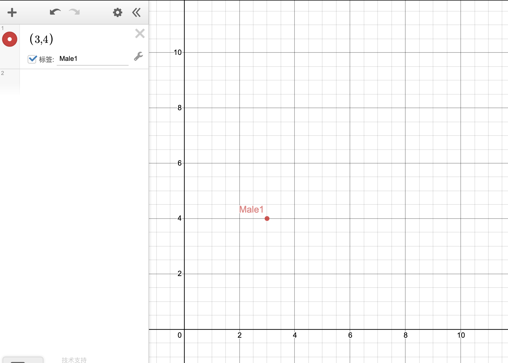

## 需求分析
  
**合约情侣**是由兰州大学心理协会举办、一年一度的活动， 旨在帮助同学们拓展自己的交际圈从而提升找到理想的恋人概率。但由于往年多采取对报名者进行随机匹配的方式进行， 双方常对匹配的结果感到不太满意，不得不说确实是一个遗憾。
  
本次的合约情侣活动将采取线上填写问卷的方式进行报名。为了提高匹配后双方的满意度， 我们有必要针对调查问卷的内容设计一种匹配策略，并根据匹配策略实现一个配对工具。
  
### 问卷形式
  
> 示例来源：DeepMatch交友平台调查问卷
  

  
如图所示，我们可以通过为受访者自身及其理想的对象设置一些属性值进行数据采集。本次的问卷的重点将在于了解 **报名者对自身的特点&价值取向的认识**
  
通过这种设置可以将每个完成了问卷的参与者进行抽象并完成匹配运算
  
### 初步分析
  
不妨假设我们的报名问卷中所有的属性值权重相等（即满足欧氏空间性质），暂且考虑如下例子：
  

  
假设调查问卷的属性值填写部分只有两个属性，那么对于每个填写问卷的人可以抽象为一个自身属性向量`S`：
  

 
为了方便理解，构造一个4个人（2男2女）的样例进行说明：
  

  
在这个案例中，我们可以将男性1（Male1）的属性向量在坐标系中表示：
  

  
由于我们有两个女性候选者，我们将她们加入坐标系：
  

  
根据我们对调查问卷中属性值的定义，我们可以同通过计算男性1属性坐标点与所有异性的属性坐标点之间的欧氏距离来判断异性与男性1理想形象的契合程度。这个距离其实就是以`Male1`坐标为起点、`Female1`与`Female2`坐标为终点的向量的模：
  

这两个向量由上图中的红色箭头表示，为方便起见将它们的模称为**渴求距离(Desire Distance, 记为`DD`)**，这个值越小则说明满意程度越高：
  

  
其中`diff`是个减法操作，后面再介绍  
分别代入`Male1`、`Female1`和`Female2`的数据算出：
  

  
可知，`DD(Male1, Female1)`远远小于`DD(Male1, Female2)`，也就是说女性1比女性2更符合男性1的求偶需求。
  
---  
  
不过既然目标是要进行双方都满意的匹配，必须综合考虑男女双方对异性的需求。通常认为，**性格与特征更加相似的男女更容易发展为亲密关系， 但良好的亲密关系中男女双方的一些性格特点可能互补** 。  
为了使设计符合上述原理，我们在问卷中设置的问题有两类：**适宜相似的属性(Similar Attribute, SA)**和**适宜互补的属性(Complementary Attribute, CA)**， 这就需要我们在计算属性值差值的操作对两类属性采取不同的处理方式：

  
其中`TotalLevels`是问题的分级范围，如每个属性值选择范围在`1-10`的话就是10  

继续就上述用例进行讨论，对每个参与者都计算其对所有异性的`DD`值：
  

  
显然，任意抽取一堆男女，他们对对方的`DD`值（满意程度）是一致的，且由于`DD`值越小说明这对男女越般配， 只需要将这组数据进行升序排序即可得到般配程度由强到弱递减的序列:
  

显然，这里面肯定会出现同一个人物出现计算了多次`DD`的情况，但由于已经完成了排序，我们只需要从前向后遍历，每访问一个记录就将序列中其它所有与当前`DD`值关联的男女记录删除即可， 最终得到：
  

  
也就是男性1(`Male1`)和女性1(`Female1`)最为般配，男性2(`Male2`)和女性2(`Female2`)最为般配，完成了匹配操作
  
### 运算推广
  
在上述例子中， 我们为问卷设置了2个权重相等可以打分的问题，也就是为每个参与报名填写问卷的对象抽象出了两个二维向量，因此我们在上述用例中使用了二维欧氏空间距离公式计算渴求距离(`DD`) ， 实际上问卷中的问题可以设置为任意多个， 只需要保证“自身属性”与“对异性的要求”的题目完全一致即可，问题的数量`p`就是最终抽象出的向量维数。那么渴求距离的计算公式就可以推广到二维欧氏距离从`p`维欧氏二范数：
  

  
大同小异。问题的个数仅仅决定了对每个问卷记录抽象出的向量维数。
  
另一个问题是每个问题的等级划分。在上述例子中，每个问题可供选择的等级被划分为`1-10`这`10`个整数，反映到实际的计算中则表现为每个向量投射到的空间的大小，理论上问题的等级划分越大，比如说本案例中所有的坐标点都被投射进了一个面积为`10*10=100`的正方形区域内，如果问题的分级减少，例如减至`7`，那么空间的面积就会变成`7*7=49`，近乎减半， 当样本容量增大时就有可能发生坐标点聚集的情况， 导致匹配精度下降。  
所以从直觉上看，问题的等级范围越大, 计算的误差将越小， 匹配的精度就越高。
  
### 时间复杂度
假设参与者中男性数量为`x`，女性数量为`y`，不妨假设男女人数数量相当， 记为`n`，那么：
  
1. 计算`DD` : `O(2 * n * n) = O(n^2)`
2. 排序：取决于排序算法，`O(nlogn)`或`O(n^2)`
   
所以总的来说，这个合约情侣匹配策略能够在多项式时间内得到解
  
### 问题与讨论
  
采取了明川哥哥提出的**直接匹配大多数属性相似、少部分属性匹配的男女参与者**的方法之后， 直接避免了引入一个难以确定参数的`FI`计算， 实现起来也变得容易了！  
现在可能还存在如下问题：
  
1. 上述策略在理论上保证了匹配的契合度与公平性，但实际上匹配的效果和问题设置有非常强的相关关系，需要心理社负责问卷设计的哥哥姐姐的努力
2. 如何如何确保男女参与者数量相当非常考验活动的宣传效果
  
加油， 奥力给！